## Requirements

* Raspberry Pi 4/5 installed with Home Assistant OS -> [Raspberry Pi - Home Assistant (home-assistant.io)](https://www.home-assistant.io/installation/raspberrypi/)
* ESP32C6 as a Matter Device that supports OpenThread
* ESP32/ESP32C3/ESP32S3 as a Matter Device tht supports BLE
* Border Router consisting of ESP32/ESP32S3 as the Host Controller and ESP32H2 as the RCP (Radio Co-Processor) that supports OpenThread
* Home Assistant Application on Android/IOS/Web Browser
* Ubuntu/WSL Computer Host
* ESP-IDF minimum v5.3.

## Set-up Matter Devices and Border Router

### Border Router

There is a Border Router development board by ESPRESSIF available on the market. On this occassion, I choose to construct my own Border Router using ESP32 as the main controller capable of Wi-Fi and BLE communications, and ESP32H2 as the Radio Co-Processor (RCP) capable of OpenThread communication.

* Follow this guide for flashing the RCP firmware to the ESP32H2 -> [esp-idf/examples/openthread/ot_rcp at master · espressif/esp-idf (github.com)](https://github.com/espressif/esp-idf/tree/master/examples/openthread/ot_rcp)
* For the ESP32 host controller, follow this guide -> [esp-thread-br/examples/basic_thread_border_router at main · espressif/esp-thread-br (github.com)](https://github.com/espressif/esp-thread-br/tree/main/examples/basic_thread_border_router)

### Generating Manufacture Partition and esp_secure_certificate

A Matter device can be flashed with manufacturer information along with secure certificate using **esp-mfg-tool**. For brief steps, you can refer to this guide [esp-matter-tools/mfg_tool at main · espressif/esp-matter-tools (github.com)](https://github.com/espressif/esp-matter-tools/tree/main/mfg_tool). Upon successful generation, your project will have **out/** folder. You will flash those files after flashing the application firmware.

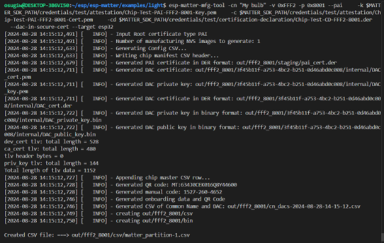

### Matter Device with OpenThread Capability

Several examples are provided by the ESP-Matter, you can choose one to build and flash the firmware to the ESP32C6. For this experiment, I use [esp-matter/examples/light_switch at main · espressif/esp-matter (github.com)](https://github.com/espressif/esp-matter/tree/main/examples/light_switch). With several modification to enable the OpenThread and generating the manufacture partition and esp_secure_certificate. For setting the firmware to use the generated partition, follow this guide:

Enter the configuration by entering this command `idf.py menuconfig`.

1. Enable Device Instance Info Provider, Device Info Provider, and Use Secure Cert DAC Provider.

   `Component Config > CHIP Device Layer > Commissioning Options`

   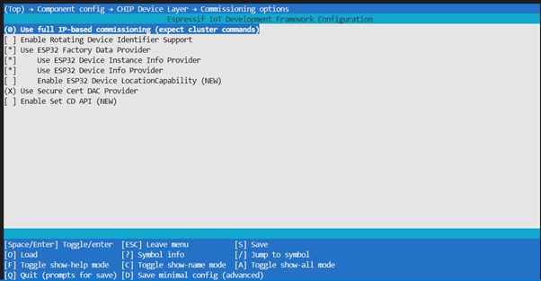
2. Define Partition Address for the manufacture partition. The default is nvs `0x10000` you can optionally change to `0x3E0000` (fctry)

   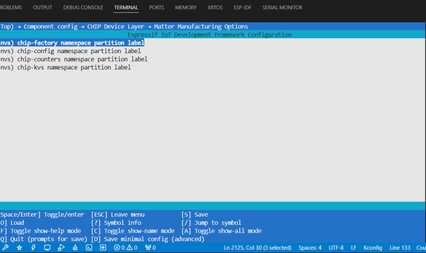
3. Config ESP Matter

   `Component Config > ESP Matter` then:

   - Change DAC Provider Options to **Secure Cert**
   - Change Commissionable Data Provider Options to **Factory**
   - Change the Device Instance Infor Provider Options to **Factory**

   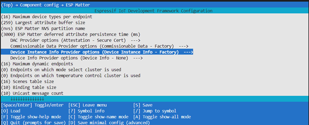
4. Save and exit

Build and flash the application firmware with the folllowing command:

`idf.py build flash`

Flash the esp_secure_cert.bin to `0xd000`. with the following command `esptool.py -p /dev/ttyUSB0  write_flash 0xd000 out/fff2_8001/<generated code>/<generated code>_esp_secure_cert.bin`

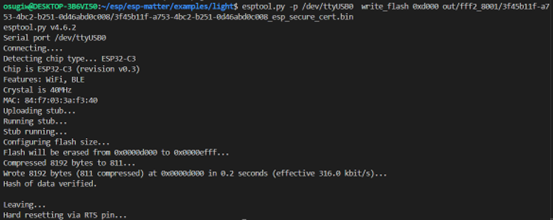

Flash the factory partition to the nvs address `0x10000` with the following command `esptool.py -p /dev/ttyUSB0  write_flash 0x10000 out/fff2_8001/<generated code>`/`<generated code>-partition.bin`

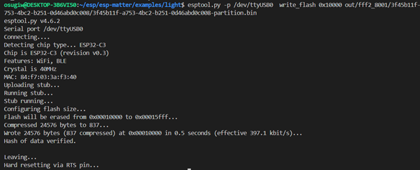

Monitor the device using the following command `idf.py monitor`

### Matter Device with BLE Capability

For this experiment, I use [esp-matter/examples/light at main · espressif/esp-matter (github.com)](https://github.com/espressif/esp-matter/tree/main/examples/light) example code. This example is intended for LED devices. We also need to modify several configuration for generating the manufacture partition and esp_secure_certificate. For setting the firmware to use the generated partition, follow this guide:

Enter the configuration by entering this command `idf.py menuconfig`.

1. Enable Device Instance Info Provider, Device Info Provider, and Use Secure Cert DAC Provider.

   `Component Config > CHIP Device Layer > Commissioning Options`

   
2. Define Partition Address for the manufacture partition. The default is nvs `0x10000` you can optionally change to `0x3E0000` (fctry)

   
3. Config ESP Matter

   `Component Config > ESP Matter` then:

   - Change DAC Provider Options to **Secure Cert**
   - Change Commissionable Data Provider Options to **Factory**
   - Change the Device Instance Infor Provider Options to **Factory**

   
4. Save and exit

As the ESP32C3 Dev board that manufactured by AI-Thinker is not addressable LED, then we need to define the LED Pin. Navigate to `Component Config > Board Support Package (generic) > LED` and configure the pin as follows:

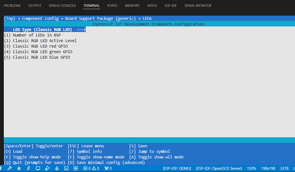

Build and flash the application firmware with the folllowing command:

`idf.py build flash`

Flash the esp_secure_cert.bin to `0xd000`. with the following command `esptool.py -p /dev/ttyUSB0  write_flash 0xd000 out/fff2_8001/<generated code>/<generated code>_esp_secure_cert.bin`

Flash the factory partition to the nvs address `0x10000` with the following command `esptool.py -p /dev/ttyUSB0  write_flash 0x10000 out/fff2_8001/<generated code>`/`<generated code>-partition.bin`

Monitor the device using the following command `idf.py monitor`

## Configuring the Border Router

Open your web browser and enter the following URL `http://homeassistant:8123/` to configure the Home Assistant. You may need to create an account for loggin in on the HA. Upon successful login you can configure the HA, navigate to `Settings > Devices & Services`

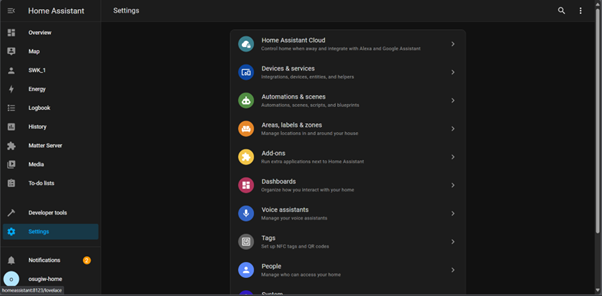

You may need to install several add-ons, including:

* Matter (BETA)
* OpenThread Border Router
* Thread

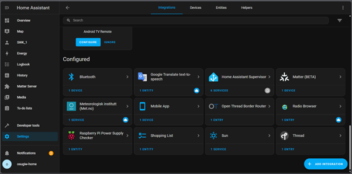

Upon installing all the add-ons, we continue to configure the ESP Border Router to the Thread Network.

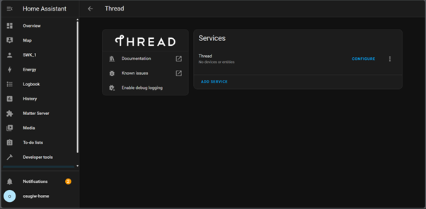

Click configure and add the OpenThread network dataset. Then, click the three dots to add the recognized ESP-BORDER-ROUTER as the preferred network.

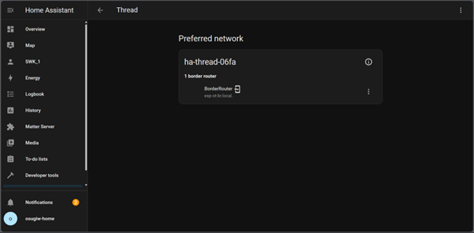

## Commission Matter Devices

The BR is ready to be used and we can add Matter Devices using Home Assistant application. Open your mobile application and navigate to `Settings > Devices & Services > Devices` and click **Add Device** and choose **Add Matter Device.** Do these steps for each Matter device.

| 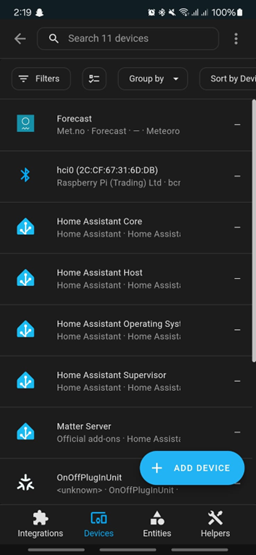 | 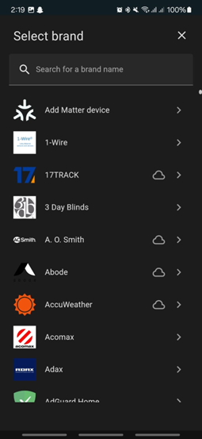 | 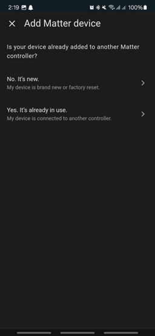 |
| ---------------------------------------------- | ---------------------------------------------- | ---------------------------------------------- |

Commission the device by scanning the QR code generated by **mfg-tool**. Follow all the steps until the device successfully commissioned.

| 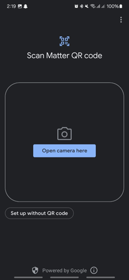 | 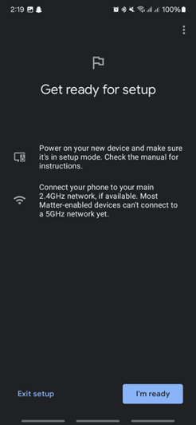 | 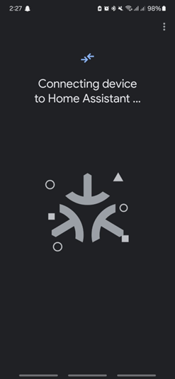 |   |
| ---------------------------------------------- | ---------------------------------------------- | ---------------------------------------------- | ----------------------------------------------------------------------------------------------------------------------------- |

At this point your dashboard will look like this and you can control the devices.

|  |  | 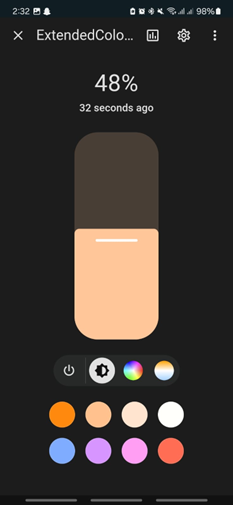 |
| ---------------------------------------------------------------------------------------------------------------------------- | ---------------------------------------------------------------------------------------------------------------------------- | ---------------------------------------------- |

Optionally, you can also add automation to trigger the LED when the switch is pressed. You can do this by navigating to **Automation Page** and configure as follows:

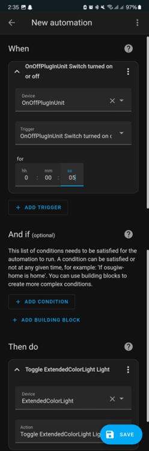

You can also read each device information by navigating to `Settings > Devices & Services > Click Matter Device`. You will see a list of devices:

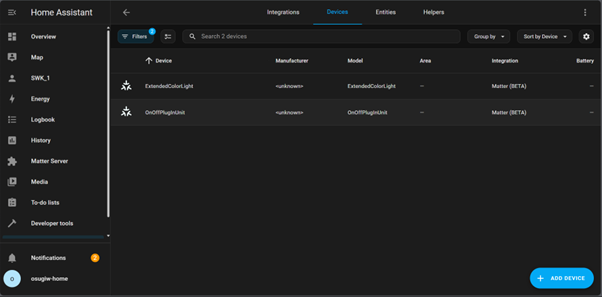

You can also see their information in more details.

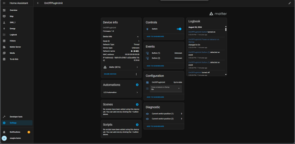

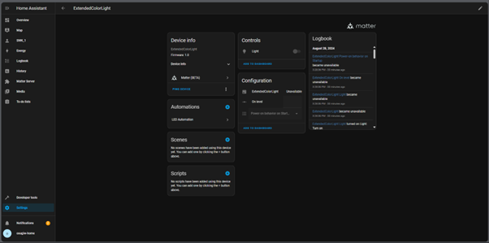

# Bonus

Here's the real condition of my experiment

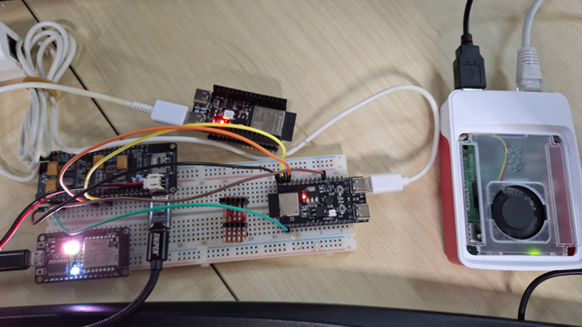
